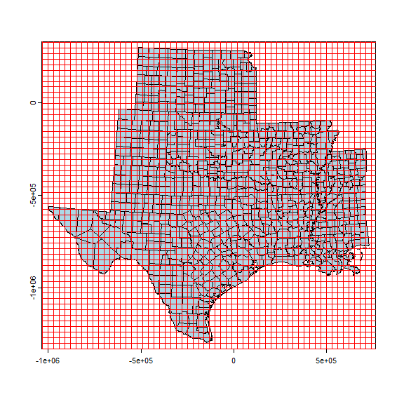
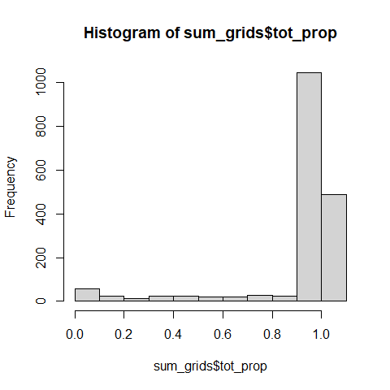
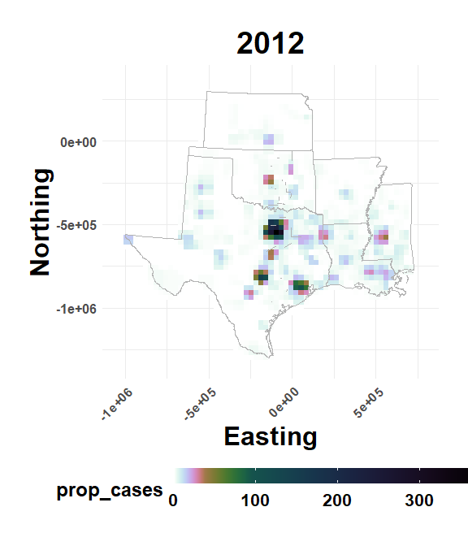
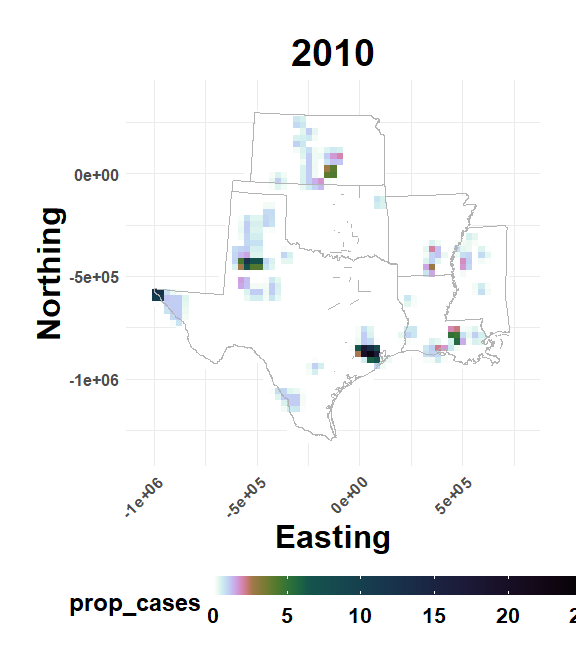
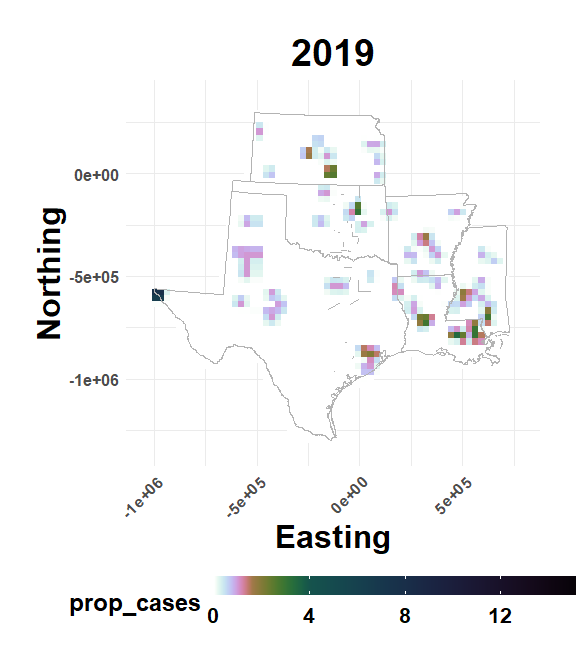
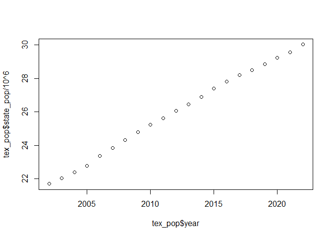
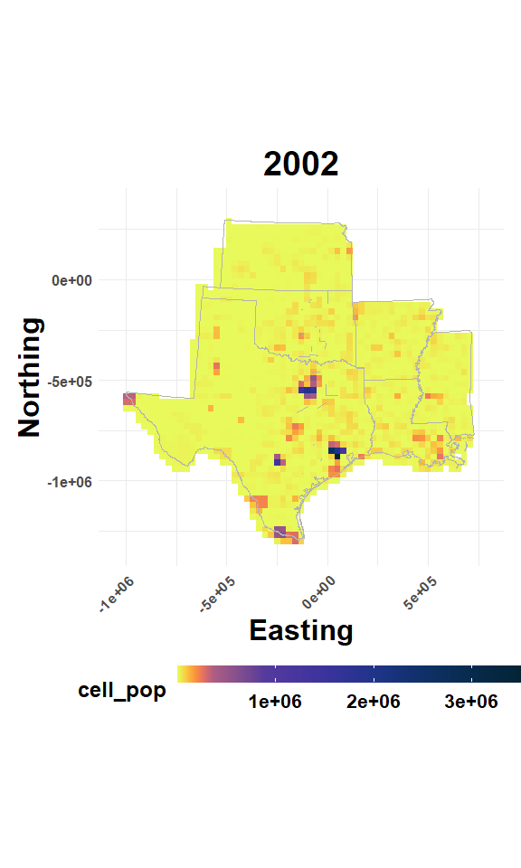
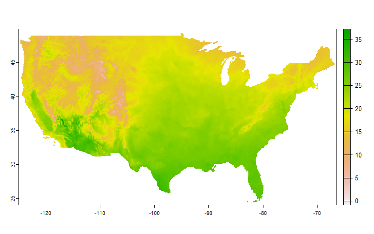
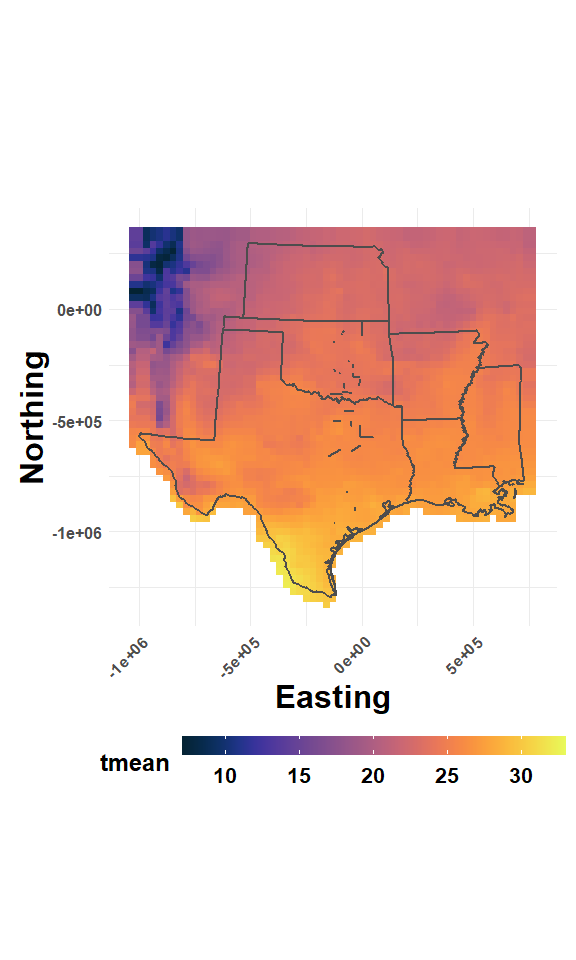

Data Download and Preprocessing
================

- <a href="#overview" id="toc-overview">Overview</a>
- <a href="#setup-atlas-hpc" id="toc-setup-atlas-hpc">Setup Atlas HPC</a>
- <a href="#setup-local-machine" id="toc-setup-local-machine">Setup Local
  Machine</a>
- <a href="#read-spatial" id="toc-read-spatial">Read Spatial</a>
- <a href="#read-wnv-data" id="toc-read-wnv-data">Read WNV Data</a>
- <a href="#calculate-proportions"
  id="toc-calculate-proportions">Calculate Proportions</a>
- <a href="#get-census" id="toc-get-census">Get Census</a>
- <a href="#get-prism-climate" id="toc-get-prism-climate">Get PRISM
  Climate</a>
- <a href="#get-land-cover" id="toc-get-land-cover">Get Land Cover</a>
- <a href="#get-habitat-heterogeneity"
  id="toc-get-habitat-heterogeneity">Get Habitat Heterogeneity</a>
- <a href="#get-elevation-and-topographic"
  id="toc-get-elevation-and-topographic">Get Elevation and Topographic</a>

## Overview

This script provides an overview of using R to download and preprocess
several publicly available data sets. The focus is on accessing and
wrangling spatial data. Supporting materials for this overview (batch
scripts, functions, etc.) are located in the same directory as this
file. To make R aware of this file’s location, load the **here**
package, which will help set relative file paths for the remainder of
this overview.

<details open>
<summary>Hide code</summary>

``` r
library(here)
```

</details>

    here() starts at D:/Github/GeoAI-Flavivirus2/features_preprocessing

## Setup Atlas HPC

For large data, like climate data, it’s often preferable to download
directly to one of our available HPC’s or long term data storage
locations like Juno. This overview assumes that you have a SCINet
account and are already familiar with project directory organization.

Installing needed r-packages used for spatial analysis on an HPC can be
challenging due the need for dependencies located outside of the
r-environment. For example, r-packages such as **terra** require that
the GDAL module be loaded before opening the r-session. Once r is open,
then the *install.packages()* command must be pointed to the locations
of needed dependencies.

To install needed geospatial packages on your Atlas HPC account:  
1. Login to Atlas. Terminal access is preferred from PowerShell or
[OnDemand](https://www.hpc.msstate.edu/computing/atlas/ood.php)  
2. Choose a directory to serve as temporary scratch space (*/home/* will
work).  
3. Copy the following files to your scratch space: A.
*install_geo_packages.sh*  
A. *install_geo_packages.txt*  
4. From the command line, Submit the Batch (*sbatch*) script (*.sh*):
**\$sbatch install_geo_packages.sh**

This script will load several modules, open R/4.4, and then run
*install_geo_packages.txt*. At the time of writing this document,
earlier versions of R were unable to link needed modules. Once R is
open, the *install_geo_packages.txt* script will install several
R-packages needed to download and process data, if the packages were not
previously installed.

## Setup Local Machine

If working from a local machine (aka, your laptop), the needed packages
can be installed using a function in the **./R** folder of this
directory.

##### First, load a utlity function to read all files in **./R** (there all functions)

<details open>
<summary>Hide code</summary>

``` r
source(here("./R/utilities.R"))
```

</details>

##### Second, load all functions in **./R** using the *source_dir* function.

<details open>
<summary>Hide code</summary>

``` r
source_dir("./R")
```

</details>

##### Third, use the *install_needed_packages()* function to install from CRAN.

<details open>
<summary>Hide code</summary>

``` r
needed_packages <- c("terra", "raster", "prism", "tidyverse")

install_needed_packages(needed_packages)
```

</details>

A function called *select()* is included in a couple different packages.
The one in **dplyr** should take precedent. Also, some of **dplyr**’s
output is a bit too verbose for me, so we handle these items here:

<details open>
<summary>Hide code</summary>

``` r
select <- dplyr::select # conflict with sp package loaded with raster
options(dplyr.summarise.inform = FALSE) # turn off messages
```

</details>

## Read Spatial

Read in project specific spatial data. These files are in the
**./assets** folder.

<details open>
<summary>Hide code</summary>

``` r
# study area county boundaries
counties <- vect(here("assets/counties/south_counties.shp")) # study area data
head(counties)
```

</details>

| OBJECTID | NAME      |  fips | STATE_NAME  |
|:---------|:----------|------:|:------------|
| 396      | Alcorn    | 28003 | Mississippi |
| 397      | Attala    | 28007 | Mississippi |
| 398      | Calhoun   | 28013 | Mississippi |
| 399      | Clarke    | 28023 | Mississippi |
| 400      | Covington | 28031 | Mississippi |
| 401      | Forrest   | 28035 | Mississippi |

<details open>
<summary>Hide code</summary>

``` r
# merge the counties into groups by STATE_NAME
state_borders <- aggregate(counties, "STATE_NAME") # state boundaries for plotting

# grid being used for analysis
grid <- vect(here("assets/grid/square_full_grid.shp")) # study area grid
head(grid)
```

</details>

| Grid_ID |
|--------:|
|       0 |
|       1 |
|       2 |
|       3 |
|       4 |
|       5 |

## Read WNV Data

Disease observations from WNV reports must be kept confidential. These
are currently in a **./PII_data** folder that’s in my R project
directory but excluded from GitHub through use of the *.gitignore* file.

<details open>
<summary>Hide code</summary>

``` r
wnv_data <- read_csv("PII_data/reduced_wnv.csv")
```

</details>

    Rows: 11826 Columns: 8
    ── Column specification ────────────────────────────────────────────────────────
    Delimiter: ","
    chr (3): county, state, location
    dbl (5): fips, year, Count_n, Count_nn, Total

    ℹ Use `spec()` to retrieve the full column specification for this data.
    ℹ Specify the column types or set `show_col_types = FALSE` to quiet this message.

<details open>
<summary>Hide code</summary>

``` r
head(wnv_data)
```

</details>

|  fips | county | state       | location          | year | Count_n | Count_nn | Total |
|------:|:-------|:------------|:------------------|-----:|--------:|---------:|------:|
| 28001 | Adams  | Mississippi | Mississippi-Adams | 2002 |       4 |        1 |     5 |
| 28001 | Adams  | Mississippi | Mississippi-Adams | 2003 |       0 |        0 |     0 |
| 28001 | Adams  | Mississippi | Mississippi-Adams | 2004 |       1 |        1 |     2 |
| 28001 | Adams  | Mississippi | Mississippi-Adams | 2005 |       3 |        1 |     4 |
| 28001 | Adams  | Mississippi | Mississippi-Adams | 2006 |       2 |        1 |     3 |
| 28001 | Adams  | Mississippi | Mississippi-Adams | 2007 |       1 |        4 |     5 |

<details open>
<summary>Hide code</summary>

``` r
# sum to year as a check
wnv_data %>%
  group_by(year) %>%
  summarise(tot = sum(Total),
            nn = sum(Count_nn),
            n = sum(Count_n))
```

</details>

| year |  tot |   nn |    n |
|-----:|-----:|-----:|-----:|
| 2002 |  809 |  171 |  638 |
| 2003 | 1126 |  392 |  734 |
| 2004 |  429 |  143 |  286 |
| 2005 |  520 |  189 |  331 |
| 2006 |  824 |  343 |  481 |
| 2007 |  603 |  270 |  333 |
| 2008 |  227 |  122 |  105 |
| 2009 |  218 |   66 |  152 |
| 2010 |  151 |   40 |  111 |
| 2011 |   95 |   32 |   63 |
| 2012 | 2761 | 1492 | 1269 |
| 2013 |  480 |  196 |  284 |
| 2014 |  630 |  254 |  376 |
| 2015 |  505 |  166 |  339 |
| 2016 |  553 |  189 |  364 |
| 2017 |  338 |  106 |  232 |
| 2018 |  352 |  116 |  236 |
| 2019 |   97 |   30 |   67 |

Quick visual check of spatial data.

<details open>
<summary>Hide code</summary>

``` r
plot(counties, col = "lightblue")
plot(grid, border="red", add=TRUE)
```

</details>



## Calculate Proportions

Calculate the ‘intersection’ or overlap between the spatial objects. The
idea is to break up individual grid cells based on counties then
determine what areal proportion within individual grid cells is from
(overlaps) each county. These functions are from the **terra** package.

<details open>
<summary>Hide code</summary>

``` r
# find overlap (aka, intersections).  
intersections <- terra::intersect(counties, grid)

# area of each intersection
intersections$intersect_area <- expanse(intersections)

# total area for each grid cell
grid$total_cell_area <- expanse(grid)

# add county total area to intersections data frame
intersections <- merge(intersections, grid[, c("Grid_ID", "total_cell_area")], by = "Grid_ID")

# proportion of each county within each grid cell
intersections$prop_cell <- intersections$intersect_area / intersections$total_cell_area

head(intersections)
```

</details>

| Grid_ID | OBJECTID | NAME   |  fips | STATE_NAME  | intersect_area | total_cell_area | prop_cell |
|--------:|:---------|:-------|------:|:------------|---------------:|----------------:|----------:|
|    3226 | 396      | Alcorn | 28003 | Mississippi |       52159586 |       900002001 | 0.0579550 |
|    3170 | 396      | Alcorn | 28003 | Mississippi |      121338835 |       900001998 | 0.1348206 |
|    3115 | 396      | Alcorn | 28003 | Mississippi |        2229698 |       900001979 | 0.0024774 |
|    3171 | 396      | Alcorn | 28003 | Mississippi |      597191258 |       900001982 | 0.6635444 |
|    3227 | 396      | Alcorn | 28003 | Mississippi |      267821974 |       900001986 | 0.2975793 |
|    2995 | 397      | Attala | 28007 | Mississippi |      244070208 |       900002084 | 0.2711885 |

### Verify proportions

The sum of proportions for most of the grid cells should be close to
1.0. Not all will sum to 1.0 because some cells are in empty space
outside counties (NA) and some are around the edges (partially NA).

<details open>
<summary>Hide code</summary>

``` r
sum_grids <- as.data.frame(intersections) %>%
  group_by(Grid_ID) %>%
  summarise(tot_prop = sum(prop_cell))

hist(sum_grids$tot_prop) # looks OK
```

</details>



### Save Weights Table

Saving a copy of the weights (proportions) so that above code doesn’t
need to be re-run every time.

<details open>
<summary>Hide code</summary>

``` r
cell_weights_table <- as.data.frame(intersections) %>%
  select(Grid_ID, prop_cell, fips, NAME, STATE_NAME) %>%
  arrange(Grid_ID)

head(cell_weights_table)
```

</details>

| Grid_ID | prop_cell |  fips | NAME     | STATE_NAME |
|--------:|----------:|------:|:---------|:-----------|
|      79 | 0.0020285 | 48141 | El Paso  | Texas      |
|      80 | 0.4018629 | 48141 | El Paso  | Texas      |
|      81 | 0.4780952 | 48141 | El Paso  | Texas      |
|     134 | 0.0069598 | 48229 | Hudspeth | Texas      |
|     135 | 0.0864740 | 48229 | Hudspeth | Texas      |
|     135 | 0.6295575 | 48141 | El Paso  | Texas      |

<details open>
<summary>Hide code</summary>

``` r
# save a copy (v1 = version 1)
# write.csv(cell_weights_table, here("assets/cell_weights_v1.csv"), row.names = FALSE)
```

</details>

### Yearly Replicate

Iterate through all years in the WNV data and calculate the county
proportion to assign to each year using the *cell_weights_table* created
above.

<details open>
<summary>Hide code</summary>

``` r
all_years <- unique(wnv_data$year)
all_agg_to_cells <- data.frame()

for(i in 1:length(all_years)){
  
  year_i <- all_years[i] # get iteration year
  
  wnv_i <- wnv_data %>% # filter WNV data to year
    filter(year == year_i)
  
  weights_i <- cell_weights_table # make copy of weights table
  
  weights_i$year <- year_i # add year to data frame
  
  weights_i$tot_cases <- with(wnv_i, # match year specific WNV data to weights by county
                            Total[match(
                              weights_i$fips,
                                        fips)])
  
  weights_i$prop_cases <- weights_i$prop_cell*weights_i$tot_cases # multiply by proportion of cell in county
  
  agg_to_cell <- weights_i %>% # sum up all sub-cell pieces to get total in cell
    group_by(year, Grid_ID) %>%
    summarise(prop_cases = sum(prop_cases)) 
  
  all_agg_to_cells <- rbind(all_agg_to_cells, agg_to_cell) # combine all iterative years
}
```

</details>

Check years

<details open>
<summary>Hide code</summary>

``` r
all_agg_to_cells %>%
  group_by(year) %>%
  summarise(tot = sum(prop_cases))
```

</details>

| year |       tot |
|-----:|----------:|
| 2002 | 2032.2313 |
| 2003 | 3128.3271 |
| 2004 | 1146.6761 |
| 2005 | 1289.0344 |
| 2006 | 2027.8145 |
| 2007 | 1547.2889 |
| 2008 |  562.7811 |
| 2009 |  552.6314 |
| 2010 |  431.1426 |
| 2011 |  255.9790 |
| 2012 | 7263.2144 |
| 2013 | 1223.1662 |
| 2014 | 1925.7902 |
| 2015 | 1380.0411 |
| 2016 | 1456.4888 |
| 2017 |  874.9663 |
| 2018 |  951.1760 |
| 2019 |  240.9477 |

### Join to WNV_Data

Checking that same *Grid_ID*s are in each data set and that there are no
NA entries.

<details open>
<summary>Hide code</summary>

``` r
# Merge data. Warning about multiple joins due to wnv_data having multiple years.  Grid_ID is same across years
wnv_data <- left_join(wnv_data, cell_weights_table, by =c("fips"))
```

</details>

    Warning in left_join(wnv_data, cell_weights_table, by = c("fips")): Each row in `x` is expected to match at most 1 row in `y`.
    ℹ Row 1 of `x` matches multiple rows.
    ℹ If multiple matches are expected, set `multiple = "all"` to silence this
      warning.

<details open>
<summary>Hide code</summary>

``` r
# ensure same unique Grid_ID
length(unique(cell_weights_table$Grid_ID)) == length(unique(wnv_data$Grid_ID))
```

</details>

    [1] TRUE

<details open>
<summary>Hide code</summary>

``` r
# any missing prop_cell?
length(which(is.na(wnv_data$prop_cell)))
```

</details>

    [1] 0

### Plot WNV Years

Using the *plot_wnv_year()* function to check a couple results. This
function is in the *./R* directory. This function is really slow due to
converting from a spatVector (terra) to a Spatial (sp) object. Much room
for improvement…

<details open>
<summary>Hide code</summary>

``` r
plot_wnv_year(grid=grid, plot_data=all_agg_to_cells, column = "prop_cases", plot_year=2012)
```

</details>

    Regions defined for each Polygons



<details open>
<summary>Hide code</summary>

``` r
plot_wnv_year(grid, all_agg_to_cells, "prop_cases", 2010)
```

</details>

    Regions defined for each Polygons



<details open>
<summary>Hide code</summary>

``` r
plot_wnv_year(grid, all_agg_to_cells, "prop_cases", 2019)
```

</details>

    Regions defined for each Polygons



<details open>
<summary>Hide code</summary>

``` r
plot_wnv_year(grid, all_agg_to_cells, "prop_cases", 2019)
```

</details>

    Regions defined for each Polygons


## Get Census

Census data is available from a few sources, including directly from the
Census Bureau, but the text file available at https://seer.cancer.gov is
pretty compact and easy to access.

### Download Pop Data

The *download_and_unzip()* function is used to download and unzip a file
from a specified url.

Data source: https://seer.cancer.gov/popdata/download.html  
Data Dictionary for codes: https://seer.cancer.gov/popdata/popdic.html

<details open>
<summary>Hide code</summary>

``` r
file_url <- "https://seer.cancer.gov/popdata/yr1990_2022.19ages/us.1990_2022.19ages.adjusted.txt.gz"

#dest_dir <- "/90daydata/flavivirus_geospatial/census/"
dest_dir <- here("census")

# Call the function
download_and_unzip(file_url, dest_dir)
```

</details>

Read and clean the file for ease of interpretation. The data is pretty
big, so it is thinned to be just total population for WNV years in the
study. This can be changed to specify the population size for specific
age groups (older humans tend to be more susceptible to WNV).

<details open>
<summary>Hide code</summary>

``` r
# read file
census_data <- read.csv(here("census/us.1990_2022.19ages.adjusted.txt"), header = FALSE, skip = 1)

# break up concatenation
census_data$year <- substr(census_data$V1, 1, 4)

# filter to WNV data years
census_data <- census_data %>% filter(year >= min(all_years))

# state abbreviation
census_data$state <- substr(census_data$V1, 5, 6)

# filter to states in study
census_data <- census_data %>% filter(state %in% c("MS", "AR", "OK", "LA", "TX", "KS"))

# separate other attributes
census_data$S.fips = substr(census_data$V1, 7, 8)
census_data$C.fips = substr(census_data$V1, 9, 11)
census_data$Geo = substr(census_data$V1, 12, 13)
census_data$Race = substr(census_data$V1, 14, 14)
census_data$Origin = substr(census_data$V1, 15, 15)
census_data$Sex = substr(census_data$V1, 16, 16)
census_data$Age = substr(census_data$V1, 17, 18)
census_data$Pop = substr(census_data$V1, 19, 26)

# don't need these
census_data <- census_data %>% select(-V1, -Geo)

# join state and county FIPS to match those in WNV data
census_data$fips <- paste0(census_data$S.fips, census_data$C.fips)
census_data$Pop <- as.integer(census_data$Pop)
```

</details>

### Check Totals

Arbitraility choosing TX for a closer look. Google says TX current
population is about 30 million.

<details open>
<summary>Hide code</summary>

``` r
total_pop <- as.data.frame(
  census_data %>%
  group_by(fips, year) %>%
  summarise(hum_pop = sum(Pop))
)

# convert to integer to match wnv_data
total_pop$fips <- as.integer(total_pop$fips)
total_pop$year <- as.integer(total_pop$year)

head(total_pop)
```

</details>

| fips | year | hum_pop |
|-----:|-----:|--------:|
| 5001 | 2002 |   20351 |
| 5001 | 2003 |   19981 |
| 5001 | 2004 |   19967 |
| 5001 | 2005 |   19954 |
| 5001 | 2006 |   19785 |
| 5001 | 2007 |   19434 |

<details open>
<summary>Hide code</summary>

``` r
# Check Texas

tex_pop <- census_data %>%
  mutate(state = substr(fips, 1, 2)) %>%
  filter(state == 48) %>%
  group_by(state, year) %>%
  summarise(state_pop = sum(Pop))

plot(tex_pop$year, tex_pop$state_pop/10^6)
```

</details>



<details open>
<summary>Hide code</summary>

``` r
max(tex_pop$state_pop) # little over 30 million, seems close
```

</details>

    [1] 30029572

### Add Population to wnv_data

Add total human population to the WNV data.

<details open>
<summary>Hide code</summary>

``` r
wnv_data <- left_join(wnv_data, total_pop, by = c("fips","year"))

range(wnv_data$hum_pop)
```

</details>

    [1]      55 4705385

<details open>
<summary>Hide code</summary>

``` r
length(which(is.na(wnv_data$hum_pop)))
```

</details>

    [1] 0

### Calculate Cell Pop

Note in the above that population was matched by COUNTY and year, not
GRID CELL and year. This code will use estimated area weights to guess
at the proportion of county-level population in each grid cell.

<details open>
<summary>Hide code</summary>

``` r
wnv_data$cell_pop <- wnv_data$hum_pop*wnv_data$prop_cell
```

</details>

### Plot Cell Pop

<details open>
<summary>Hide code</summary>

``` r
plot_wnv_year(grid=grid, plot_data=wnv_data, column = "cell_pop", plot_year=2002, col_palette = "ocean")
```

</details>

    Regions defined for each Polygons



<details open>
<summary>Hide code</summary>

``` r
plot_wnv_year(grid=grid, plot_data=wnv_data, column = "cell_pop", plot_year=2019, col_palette = "ocean")
```

</details>

    Regions defined for each Polygons


#### Save a copy of updated WNV data

<details open>
<summary>Hide code</summary>

``` r
write.csv(wnv_data, here("PII_data/reduced_wnv_pop.csv"), row.names = FALSE)
```

</details>

## Get PRISM Climate

PRISM climate data (https://prism.oregonstate.edu/) is available in
several formats and can be downloaded using the the R-**prism** package.
The example here uses the function *get_prism_monthlys()* to get monthly
*tmean* or monthly mean temperature data for the whole U.S., but
*get_prism_annual()* or *get_prism_dailys()* can also be used, see:
https://cran.r-project.org/web/packages/prism/index.html.

This is an example only, but data for mean, minimum, and maximum
temperature as well as total precipitation has already been downloaded
to the *90daydata* directory shown in the below code. All months from
2002-2023 for these variables is there.

The FULL download process can be re-run using the following steps:  
1. Login to Atlas. Terminal access is preferred from PowerShell or
[OnDemand](https://www.hpc.msstate.edu/computing/atlas/ood.php)  
2. Choose a directory to serve as temporary scratch space (*/home/* will
work).  
3. Copy the following files to your scratch space:  
A. *get_prism_climate.sh*  
B. *get_prism_climate.txt*  
4. From the command line, Submit the Batch (*sbatch*) script (*.sh*):
**\$sbatch get_prism_climate.sh**

The current target directory in *get_prism_climate.txt* is
*/90daydata/flavivirus_geospatial/raw_sp_features/prism_climate/*, be
sure to change this if another location is preferred.

#### Example Download

An example of how the function works. See the *get_prism_climate.txt*
script and the
*/90daydata/flavivirus_geospatial/raw_sp_features/prism_climate/* to see
this process extended to all data sets.

<details open>
<summary>Hide code</summary>

``` r
prism_set_dl_dir(here("assets/tmean")) # write data to the tmean folder in the assets directory

# choose and download data
get_prism_monthlys(type = 'tmean', # climate variable wanted, options: "ppt", "tmean", "tmin", "tmax"
                   years = 2019, # years wanted, may be multiple 2002:2023
                   mon = 6,  # months wanted, may be multiple 1:12
                   keepZip = FALSE) # delete downloaded zip files
```

</details>

### Plot CONUS data

What the full raster looks like.

<details open>
<summary>Hide code</summary>

``` r
# read the raster
june_tmean <- rast(
  here("assets/tmean/PRISM_tmean_stable_4kmM3_201906_bil/PRISM_tmean_stable_4kmM3_201906_bil.bil")
)

june_tmean # details
```

</details>

    class       : SpatRaster 
    dimensions  : 621, 1405, 1  (nrow, ncol, nlyr)
    resolution  : 0.04166667, 0.04166667  (x, y)
    extent      : -125.0208, -66.47917, 24.0625, 49.9375  (xmin, xmax, ymin, ymax)
    coord. ref. : lon/lat NAD83 
    source      : PRISM_tmean_stable_4kmM3_201906_bil.bil 
    name        : PRISM_tmean_stable_4kmM3_201906_bil 
    min value   :                             -0.8545 
    max value   :                             37.2600 

<details open>
<summary>Hide code</summary>

``` r
plot(june_tmean) # quick peek
```

</details>



### Extract to Grid Cells

An example of how values can be extracted to grid locations. **Note:**
The “mean” function is used indicating to calculate the mean of all
raster cells within the area defined by each grid cell. This function
may be changed to min or max.

<details open>
<summary>Hide code</summary>

``` r
june_tmean.prj <- project(june_tmean, crs(grid))

grid$tmean <- terra::extract(june_tmean.prj, grid, fun="mean", na.rm=TRUE)[,"PRISM_tmean_stable_4kmM3_201906_bil"]
```

</details>

#### Replace NaN entries with NA

NA entries are more easily recognized by other functions.

<details open>
<summary>Hide code</summary>

``` r
range(grid$tmean)
```

</details>

    [1] NaN NaN

<details open>
<summary>Hide code</summary>

``` r
grid$tmean[is.nan(grid$tmean)] <- NA

range(grid$tmean)
```

</details>

    [1] NA NA

<details open>
<summary>Hide code</summary>

``` r
range(grid$tmean, na.rm=TRUE)
```

</details>

    [1]  7.068938 32.202790

#### Plot tmean by grid cell

A plot showing the “mean” of all mean temperature cells (tmean) in each
grid cell.

<details open>
<summary>Hide code</summary>

``` r
plot_prism(grid=grid, plot_data=as.data.frame(grid), column = "tmean", col_palette = "ocean")
```

</details>

    Regions defined for each Polygons



### Extract All PRISM to Grid

Given the example raster extraction shown above, we next want to loop
through all monthly rasters, for all years, and all variables.

Example code is shown below as an example of the process, but to avoid
saving the data locally, the real extractions were performed using a
batch script (the data has already been extracted).

The extraction process can be re-run using the following steps:  
1. Login to Atlas. Terminal access is preferred from PowerShell or
[OnDemand](https://www.hpc.msstate.edu/computing/atlas/ood.php)  
2. Choose a directory to serve as temporary scratch space (*/home/* will
work).  
3. Copy the following files to your scratch space:  
A. *extract_prism.sh*  
B. *extract_prism.txt*  
4. From the command line, Submit the Batch (*sbatch*) script (*.sh*):
**\$sbatch extract_prism.sh**

Here is the basic steps the batch job will perform:

<details open>
<summary>Hide code</summary>

``` r
# main directory
target_directory <- "/90daydata/flavivirus_geospatial/raw_sp_features"
   
# spatial spatVect to define grid cells
grid <- vect(paste0(target_directory, "/assets/grid/square_full_grid.shp"))
  
# PRISM variables to extract
folders_to_process <- c("tmin", "tmax", "tmean", "ppt")

# loop through each PRISM variable
for(i in 1:length(folders_to_process)){
  
  # folder with variable raster files
  target_folder <- folders_to_process[i]
    
  # get all files names   
  file_names <- list.files(path = paste0(target_directory, "/prism_climate","/", target_folder),       
                           pattern="*.bil$", full.names=T, recursive=T) 
                           
  # Convert file paths to data frame, creating a lookup table with metadata                           
  file_names_df <- data.frame(path=file_names)
  file_names_df$is_prov = grepl("provisional", file_names_df$path)
  file_names_df$date_seq <- sub(".*_([0-9]+)_bil\\.bil", "\\1", file_names_df$path)
  file_names_df$year <- as.integer(substr(file_names_df$date_seq, 1, 4)) 
  file_names_df$month <- as.integer(substr(file_names_df$date_seq, 5, 6)) 
  
  # create out_df with Grid_ID
  tmp_df <- data.frame(Grid_ID=grid$Grid_ID)
  
  for(j in 1:nrow(file_names_df)){
    
    tmp_raster <- rast(file_names_df$path[j])  # load a rasters one at a time
    
    tmp_raster <- project(tmp_raster, crs(grid)) # geographic conversion to grid projection
    
    # Extract values 
    mean_values <- as.data.frame(
      terra::extract(tmp_raster, grid, fun="mean", na.rm=TRUE)[,names(tmp_raster)]
    )
    
    value_col_name <- paste(target_folder, file_names_df$year[j], file_names_df$month[j], sep="_") 
      colnames(mean_values) <- value_col_name
    
    # Combine mean_values with Grid_ID
    tmp_df <- cbind(tmp_df, mean_values)
    
  }
  
  # extracted data
  write_csv(tmp_df, paste(target_directory, "prism_climate/grid_extraction", 
                          paste0(target_folder, "_", Sys.Date(), ".csv"), sep="/"))
  
  # copy of lookup table for reference
  write_csv(file_names_df, paste(target_directory, 
                                 paste0("prism_climate/prism_path_lookup_", 
                                        target_folder, "_", Sys.Date(), ".csv"), sep="/"))

}
```

</details>

## Get Land Cover

There are several sources of land cover data available. The National
Land Cover Database
[NLCD](https://www.usgs.gov/centers/eros/science/national-land-cover-database)
is probably the most popular, however, I recommend using the
[EarthEnvironment](https://www.earthenv.org/) data available from the
Jetz lab at Cornell. The main benefit is that the 1x1km raster cells
report the proportion of each land cover type. Because proportions are
continuous values (though censored) they are easier to work with than
the discrete classes given in the NLCD.

#### Download Global 1-km Consensus Land Cover

The links to the data are numbered sequentially 1-12 indicating 12
different land cover classes.

There’s a text file in the repo that has the names:

<details open>
<summary>Hide code</summary>

``` r
EarthEnv_tab <- read_csv(here("assets/EarthEnv_labels.csv"))
```

</details>

    Rows: 12 Columns: 2
    ── Column specification ────────────────────────────────────────────────────────
    Delimiter: ","
    chr (1): NAME
    dbl (1): Type

    ℹ Use `spec()` to retrieve the full column specification for this data.
    ℹ Specify the column types or set `show_col_types = FALSE` to quiet this message.

<details open>
<summary>Hide code</summary>

``` r
EarthEnv_tab
```

</details>

| Type | NAME                                 |
|-----:|:-------------------------------------|
|    1 | Evergreen/Deciduous Needleleaf Trees |
|    2 | Evergreen Broadleaf Trees            |
|    3 | Deciduous Broadleaf Trees            |
|    4 | Mixed/Other Trees                    |
|    5 | Shrubs                               |
|    6 | Herbaceous Vegetation                |
|    7 | Cultivated and Managed Vegetation    |
|    8 | Regularly Flooded Vegetation         |
|    9 | Urban/Built-up                       |
|   10 | Snow/Ice                             |
|   11 | Barren                               |
|   12 | Open Water                           |

Because there are only 12 of these rasters, the *download_and_unzip()*
can be applied in a loop to download the files. source:
https://www.earthenv.org/landcover

<details open>
<summary>Hide code</summary>

``` r
target_directory <- "/90daydata/flavivirus_geospatial/raw_sp_features/earth_env/"

concen_landcover_web <- "http://data.earthenv.org/consensus_landcover/with_DISCover/"

for(i in 1:12){
  
  tmp_name <- paste0("consensus_full_class_", i,".tif") 
  
  dl_path <- paste0(concen_landcover_web, tmp_name)
  
  download_file(dl_path, paste0(target_directory, tmp_name))
  
}
```

</details>

## Get Habitat Heterogeneity

The Earth Environment site has several other data sets that might be
informative. For example, [Global Habitat
Heterogeneity](https://www.earthenv.org/texture) includes 14 metrics
quantifying spatial heterogeneity of global habitat at multiple
resolutions based on the textural features of Enhanced Vegetation Index
(EVI) imagery acquired by MODIS.

These metrics are derived from satellite vegetation data and are another
way of getting at land use variation to supplement the consensus land
cover downloaded above. In addition to providing physical habitat,
plants play a major role in regulating land surface temperature and
humidity which influence arthropod distribution and abundance. For
example, an urban heat island devoid of vegetation vs. a dense tree
forest vs. open grasslands.

There’s a text file in the repo that has the names:

<details open>
<summary>Hide code</summary>

``` r
HabHetero_tab <- read_csv(here("assets/habitat_heterog_labels.csv"))
```

</details>

    Rows: 14 Columns: 4
    ── Column specification ────────────────────────────────────────────────────────
    Delimiter: ","
    chr (4): Metric, Measure, Value Range, Expected Relationship with Heterogeneity

    ℹ Use `spec()` to retrieve the full column specification for this data.
    ℹ Specify the column types or set `show_col_types = FALSE` to quiet this message.

<details open>
<summary>Hide code</summary>

``` r
HabHetero_tab
```

</details>

| Metric                   | Measure                                                          | Value Range                            | Expected Relationship with Heterogeneity |
|:-------------------------|:-----------------------------------------------------------------|:---------------------------------------|:-----------------------------------------|
| Coefficient of variation | Normalized dispersion of EVI                                     | \>=0                                   | Positive                                 |
| Evenness                 | Evenness of EVI                                                  | \>=0; \<=1                             | Positive                                 |
| Range                    | Range of EVI                                                     | \>=0                                   | Positive                                 |
| Shannon                  | Diversity of EVI                                                 | \>=0; \<=ln(max \# of different EVI)   | Positive                                 |
| Simpson                  | Diversity of EVI                                                 | \>=0; \<=1-1/(max \# of different EVI) | Positive                                 |
| Standard deviation       | Dispersion of EVI                                                | \>=0                                   | Positive                                 |
| Contrast                 | Exponentially weighted difference in EVI between adjacent pixels | \>=0                                   | Positive                                 |
| Correlation              | Linear dependency of EVI on adjacent pixels                      | \>=-1; \<=1                            | Nonlinear                                |
| Dissimilarity            | Difference in EVI between adjacent pixels                        | \>=0                                   | Positive                                 |
| Entropy                  | Disorderliness of EVI                                            | \>=0                                   | Positive                                 |
| Homogeneity              | Similarity of EVI between adjacent pixels                        | \>=0; \<=1                             | Negative                                 |
| Maximum                  | Dominance of EVI combinations between adjacent pixels            | \>=0; \<=1                             | Negative                                 |
| Uniformity               | Orderliness of EVI                                               | \>=0; \<=1                             | Negative                                 |
| Variance                 | Dispersion of EVI combinations between adjacent pixels           | \>=0                                   | Positive                                 |

#### Get the data

Downloading the 1x1km version of all 14 variables.

source: https://www.earthenv.org/texture

<details open>
<summary>Hide code</summary>

``` r
target_directory <- "/90daydata/flavivirus_geospatial/raw_sp_features/habitat_hetero/"

habitat_hetero_web <- "http://data.earthenv.org/habitat_heterogeneity/1km/"

# variable names
habitat_mets <- c("cv", "evenness", "range", "shannon", "simpson", "std", "Contrast", "Correlation",
                  "Dissimilarity", "Entropy", "Homogeneity", "Maximum", "Uniformity", "Variance")

for(i in 1:length(habitat_mets)){
  
  if(habitat_mets[i] %in% c("Contrast", "Dissimilarity", "Variance")){
    end_string = "_01_05_1km_uint32.tif"
    } else{
      end_string = "_01_05_1km_uint16.tif"
    }
  
  if(habitat_mets[i] == "Correlation"){
     end_string = "_01_05_1km_int16.tif"
  }
  
  tmp_name <- paste0(habitat_mets[i], end_string) 
  
  dl_path <- paste0(habitat_hetero_web, tmp_name)
  
  download_file(dl_path, paste0(target_directory, tmp_name))
  
}
```

</details>

## Get Elevation and Topographic

Earth Environment has a bunch of elevation and top variables available.

#### Grab Topo

source: https://www.earthenv.org/topography

<details open>
<summary>Hide code</summary>

``` r
target_directory <- "/90daydata/flavivirus_geospatial/raw_sp_features/elevation_topo/"

elev_topo_web <- "data.earthenv.org/topography/"

# variable names
elev_derivs <- c("elevation", "slope", "aspectcosine", "aspectsine", "roughness", 
                 "tpi", "tri", "vrm", "pcurv", "tcurv")

for(i in 1:length(elev_derivs)){
  
  tmp_name <- paste0(elev_derivs[i], "_1KMmd_GMTEDmd.tif") 
  
  dl_path <- paste0(elev_topo_web, tmp_name)
  
  download_file(dl_path, paste0(target_directory, tmp_name))
  
}
```

</details>

#### More to come….
