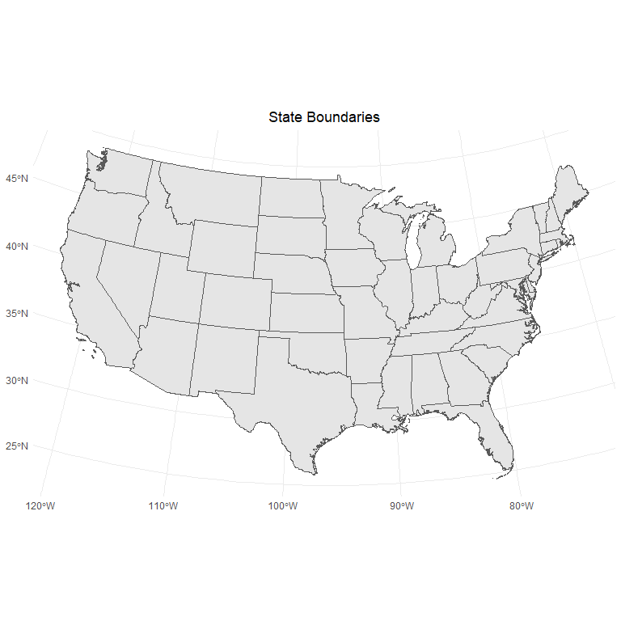
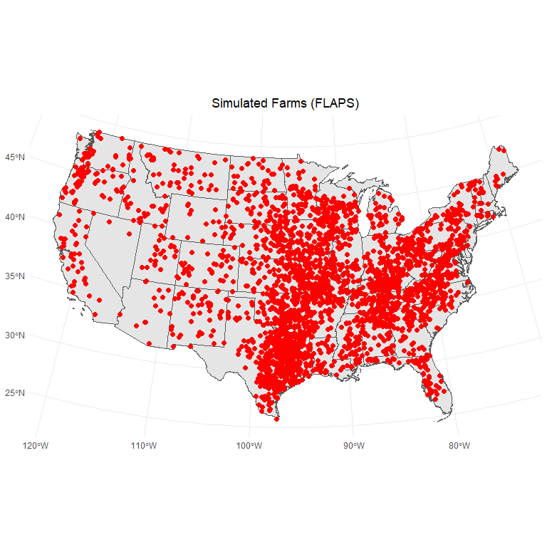

Importing FLAPS Data from OSF
================

- <a href="#overview" id="toc-overview">Overview</a>
- <a href="#setup" id="toc-setup">Setup</a>
- <a href="#get-flaps" id="toc-get-flaps">Get FLAPS</a>

## Overview

This script demonstrates how to download and view FLAPS data stored on
the Open Science Framework (OSF).

## Setup

### Libraries

Except for the **osfr** package specific to OSF and **rnaturalearth**,
which includes geographic bondary files, these are pretty standard.

<details open>
<summary>Hide code</summary>

``` r
library(here) # project directory management
library(tidyverse) # all things tidy - ggplot
library(tidyterra) # spatial tidy tools
library(sf) # spatial data manipulation

library(rnaturalearth) # used tget state boundaries
library(osfr) # designed to help access OSF sites
```

</details>

### State Boundaries

Get geographic boundaries to visually check FLAPS data.

<details open>
<summary>Hide code</summary>

``` r
us_states <- ne_states(country = "United States of America", # polygons
                       returnclass = "sf") # use sf package  

contiguous_us <- us_states %>%# drop these states
  filter(!name %in% c("Alaska", "Hawaii"))

my_projection <- 5070 # NAD83 / Conus Albers / meters
contiguous_us <- st_transform(contiguous_us, crs = my_projection) # project file from lat/long
```

</details>

Quick plot to check:

<details open>
<summary>Hide code</summary>

``` r
ggplot(data = contiguous_us) +
  geom_sf() +
  theme_minimal() +
  labs(title = "State Boundaries") +
  theme(plot.title = element_text(hjust = 0.5),
        plot.subtitle = element_text(hjust = 0.5)) +
   coord_sf(crs = st_crs(my_projection))
```

</details>



## Get FLAPS

A bit tedious to get the identifiers needed for download, but the detail
is useful in more complicated projects and workflows.

### Retrieve Metadata

Get FLAPS file metadata from the website, which is located here:
https://osf.io/f9x4a/ Note the code at the end of the web address is
used below.

<details open>
<summary>Hide code</summary>

``` r
files_in_flaps <- osf_retrieve_node("f9x4a") %>%  # website metadata
  osf_ls_files() %>%                              # folder metadata
  pull(id) %>%                                    # get folder ID
  osf_retrieve_file() %>%                         # retrieve folder contents
  osf_ls_files()                                  # list folder contents
```

</details>

The **id** code identifies the file

<details open>
<summary>Hide code</summary>

``` r
files_in_flaps # full file metadata
```

</details>

    # A tibble: 10 × 3
       name                 id                       meta            
       <chr>                <chr>                    <list>          
     1 flaps12_max_0006.txt 66de2cab25314ae4d2459c9c <named list [3]>
     2 flaps12_max_0001.txt 66de2d41adef636b5977b927 <named list [3]>
     3 flaps12_max_0002.txt 66de2d44a430cfdfd51eb5a9 <named list [3]>
     4 flaps12_max_0004.txt 66de2d4625314ae4d2459cdc <named list [3]>
     5 flaps12_max_0003.txt 66de2d468ca56aa9e61eb6d5 <named list [3]>
     6 flaps12_min_0010.txt 66de2d158ca56aa9e61eb6ba <named list [3]>
     7 flaps12_max_0009.txt 66de2caba430cfdfd51eb569 <named list [3]>
     8 flaps12_max_0010.txt 66de2cabb6dc6a8c69a3ce2d <named list [3]>
     9 flaps12_min_0003.txt 66de2cdcce25552c98a3d201 <named list [3]>
    10 flaps12_min_0005.txt 66de2cdedd86c590f52e0581 <named list [3]>

<details open>
<summary>Hide code</summary>

``` r
files_in_flaps$name # names of individual files
```

</details>

     [1] "flaps12_max_0006.txt" "flaps12_max_0001.txt" "flaps12_max_0002.txt"
     [4] "flaps12_max_0004.txt" "flaps12_max_0003.txt" "flaps12_min_0010.txt"
     [7] "flaps12_max_0009.txt" "flaps12_max_0010.txt" "flaps12_min_0003.txt"
    [10] "flaps12_min_0005.txt"

<details open>
<summary>Hide code</summary>

``` r
files_in_flaps$id # ID numbers needed to pull files
```

</details>

     [1] "66de2cab25314ae4d2459c9c" "66de2d41adef636b5977b927"
     [3] "66de2d44a430cfdfd51eb5a9" "66de2d4625314ae4d2459cdc"
     [5] "66de2d468ca56aa9e61eb6d5" "66de2d158ca56aa9e61eb6ba"
     [7] "66de2caba430cfdfd51eb569" "66de2cabb6dc6a8c69a3ce2d"
     [9] "66de2cdcce25552c98a3d201" "66de2cdedd86c590f52e0581"

### Download Select Files

Use the **id** numbers to select individual files.

<details open>
<summary>Hide code</summary>

``` r
files_in_flaps$id[2] # select any file in list
```

</details>

    [1] "66de2d41adef636b5977b927"

<details open>
<summary>Hide code</summary>

``` r
# download to destination path
osf_retrieve_file(files_in_flaps$id[2]) %>% #use the id code to select files
                osf_download(conflicts = "overwrite", # overwrite existing file
                             path = here("2024-09-08-osf_geospatial")) # where to save
```

</details>

    # A tibble: 1 × 4
      name                 id                       local_path          meta        
      <chr>                <chr>                    <chr>               <list>      
    1 flaps12_max_0001.txt 66de2d41adef636b5977b927 ./flaps12_max_0001… <named list>

### Download All Files

If all files are needed(\~450mb), then they can be downloaded at once
using:

<details open>
<summary>Hide code</summary>

``` r
osf_download(files_in_flaps, 
             path = here(), # where to save the files (project directory in this example)
             conflicts = "overwrite") # overwrite existing
```

</details>

### Read File

The file should now be downloaded and accessible to R. Id is a unique
*farm* idnetfier, FIPS is the state-county code (Federal Information
Processing Standard). Beef is the head of beef cattle and dairy the
number of dairy cows on the farm. The premises classes b,d,f,m stand for
*beef*, *dairy*, *feedlot*, and *market* respectively. Little **xy** are
the geographic coordinates.

<details open>
<summary>Hide code</summary>

``` r
flaps_data <- read_tsv(here("2024-09-08-osf_geospatial", files_in_flaps$name[2]))
```

</details>

    Rows: 814247 Columns: 7
    ── Column specification ────────────────────────────────────────────────────────
    Delimiter: "\t"
    chr (1): class
    dbl (6): ID, FIPS, beef, dairy, x, y

    ℹ Use `spec()` to retrieve the full column specification for this data.
    ℹ Specify the column types or set `show_col_types = FALSE` to quiet this message.

<details open>
<summary>Hide code</summary>

``` r
dim(flaps_data)[1] # number of farms 
```

</details>

    [1] 814247

<details open>
<summary>Hide code</summary>

``` r
head(flaps_data)
```

</details>

    # A tibble: 6 × 7
         ID  FIPS  beef dairy class         x        y
      <dbl> <dbl> <dbl> <dbl> <chr>     <dbl>    <dbl>
    1     2 53009    35     0 b     -2096173. 3120127.
    2     3 53009    33     0 b     -2096764. 3117692.
    3     4 53009    30     0 b     -2096401. 3116955.
    4     5 53009     5     0 b     -2096283. 3116793.
    5     6 53009    10     0 b     -2095467. 3119407.
    6     7 53009    10     0 b     -2094929. 3120861.

### Spatial FLAPS

There is a lot of data, subsample the data before visualizing.

<details open>
<summary>Hide code</summary>

``` r
small_flaps_data <- flaps_data %>% # random sample
  sample_n(size = 3000)

flaps_pnts <- st_as_sf(small_flaps_data, coords = c("x", "y"), crs = 5070)
```

</details>

### Map FLAPS

<details open>
<summary>Hide code</summary>

``` r
ggplot(data = contiguous_us) +
  geom_sf() +
  geom_sf(data = flaps_pnts, color = "red", size = 2) +
  theme_minimal() +
  labs(title = "Simulated Farms (FLAPS)") +
  theme(plot.title = element_text(hjust = 0.5),
        plot.subtitle = element_text(hjust = 0.5)) +
   coord_sf(crs = st_crs(my_projection))
```

</details>


