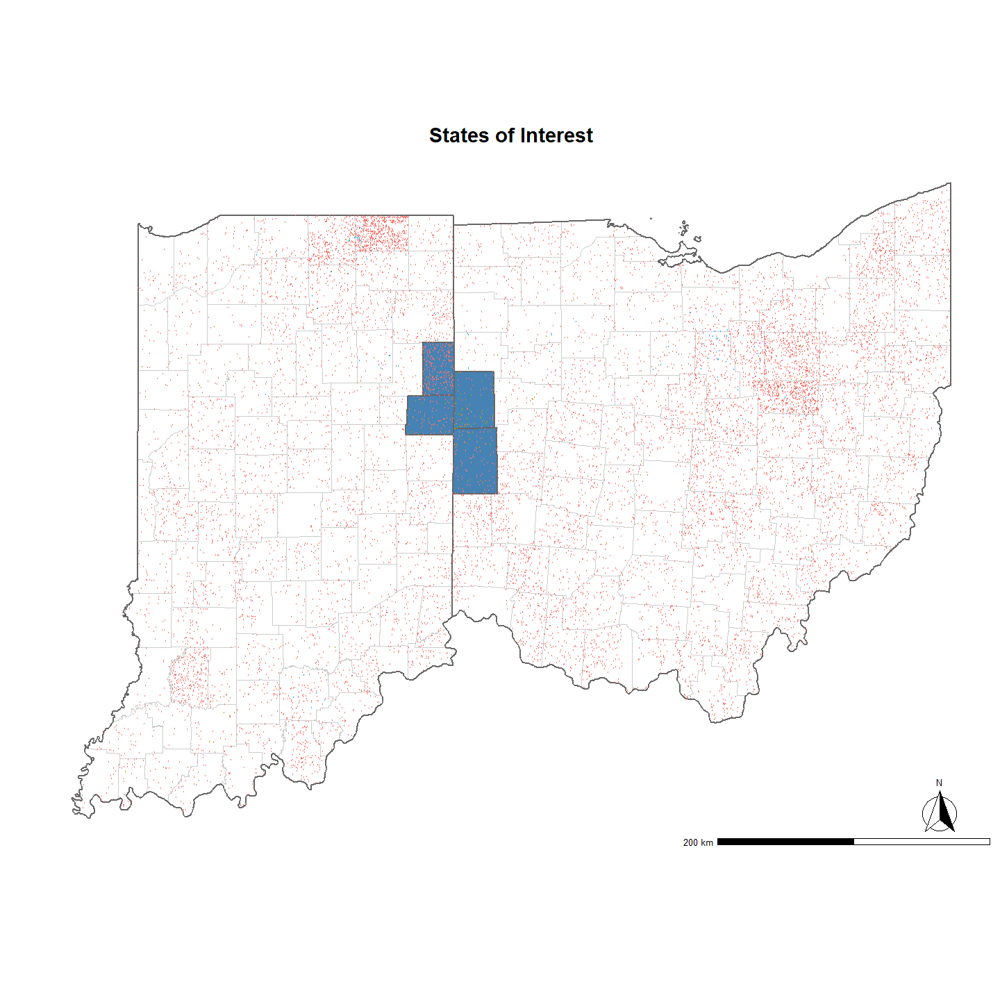
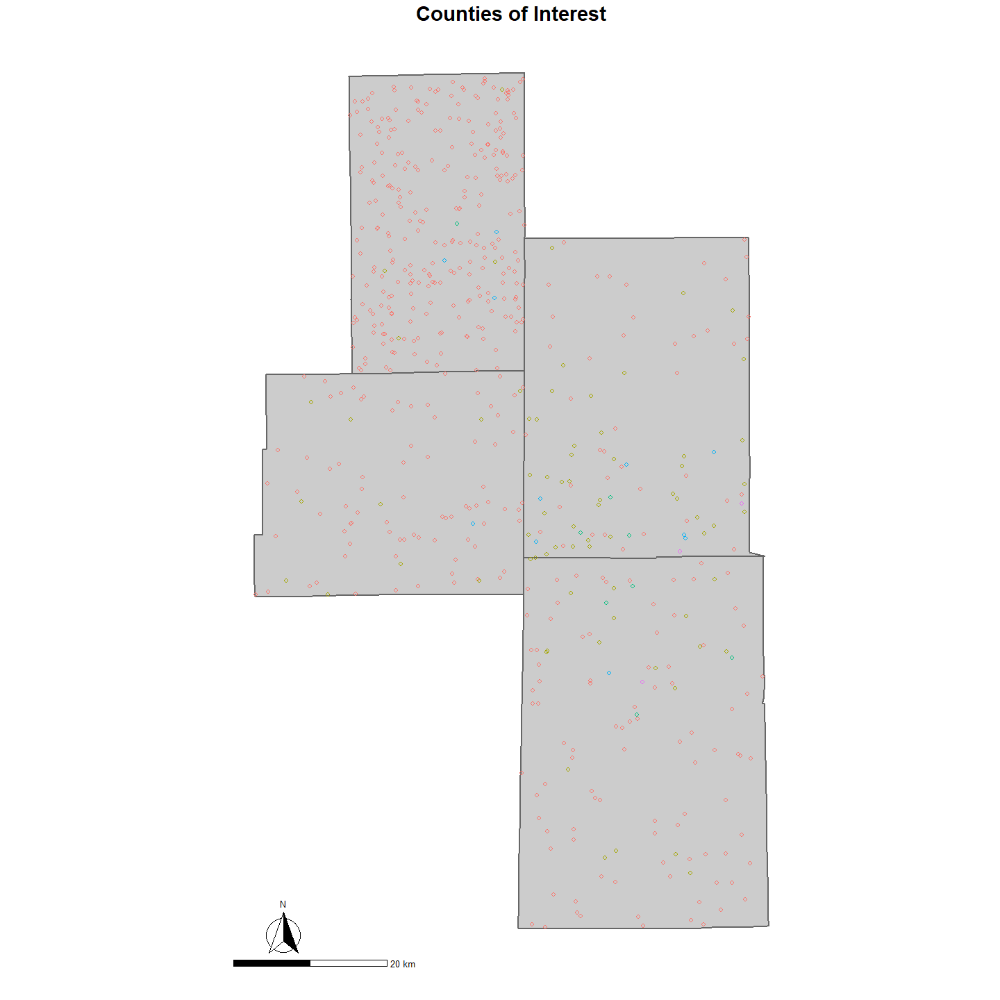

Map Plots in R
================

- <a href="#overview" id="toc-overview">Overview</a>
- <a href="#read-poultry-data" id="toc-read-poultry-data">Read Poultry
  Data</a>
- <a href="#get-state-boundaries" id="toc-get-state-boundaries">Get State
  Boundaries</a>
- <a href="#get-county-boundaries" id="toc-get-county-boundaries">Get
  County Boundaries</a>
- <a href="#state-level" id="toc-state-level">State Level</a>
- <a href="#county-level" id="toc-county-level">County Level</a>
- <a href="#save-copy" id="toc-save-copy">Save Copy</a>

## Overview

Example map plots

### Libraries

<details open>
<summary>Hide code</summary>

``` r
library(here) # directory management
library(tidyverse) # data wrangling
library(ggspatial) # map annotation
library(terra) # spatial data wrangling
library(sf) # spatial data wrangling
library(tigris) # state and county boundaries

# retain tigris downloads
options(tigris_use_cache = TRUE)
```

</details>

## Read Poultry Data

<details open>
<summary>Hide code</summary>

``` r
layers_df <- read_csv(here("local/Poultry_hybrid_FINAL_CSVs/layers_hybrid_FINAL.csv"))
```

</details>

    Rows: 197608 Columns: 9
    ── Column specification ────────────────────────────────────────────────────────
    Delimiter: ","
    chr (4): State, commodityType, category, sector
    dbl (5): fips, st_fips, POINT_X, POINT_Y, population

    ℹ Use `spec()` to retrieve the full column specification for this data.
    ℹ Specify the column types or set `show_col_types = FALSE` to quiet this message.

<details open>
<summary>Hide code</summary>

``` r
head(layers_df)
```

</details>

    # A tibble: 6 × 9
       fips st_fips State POINT_X POINT_Y population commodityType category sector  
      <dbl>   <dbl> <chr>   <dbl>   <dbl>      <dbl> <chr>         <chr>    <chr>   
    1  1001       1 AL      -86.7    32.7         20 layers        BY       Product…
    2  1001       1 AL      -86.7    32.7         20 layers        BY       Product…
    3  1001       1 AL      -86.6    32.7         12 layers        BY       Product…
    4  1001       1 AL      -86.4    32.7         13 layers        BY       Product…
    5  1001       1 AL      -86.5    32.7         30 layers        BY       Product…
    6  1001       1 AL      -86.4    32.7         14 layers        BY       Product…

<details open>
<summary>Hide code</summary>

``` r
dim(layers_df)
```

</details>

    [1] 197608      9

<details open>
<summary>Hide code</summary>

``` r
# filter to states of interest
layers_st <- layers_df %>%
  filter(State %in% c("OH", "IN"))
```

</details>

## Get State Boundaries

<details open>
<summary>Hide code</summary>

``` r
states_all <- states(cb = TRUE) # all states
```

</details>

    Retrieving data for the year 2024

<details open>
<summary>Hide code</summary>

``` r
# subset to target states
oh_in_states <- subset(states_all, NAME %in% c("Ohio", "Indiana")) # Ohio and Indiana
```

</details>

## Get County Boundaries

<details open>
<summary>Hide code</summary>

``` r
all_counties <- counties(cb = TRUE)
```

</details>

    Retrieving data for the year 2024

<details open>
<summary>Hide code</summary>

``` r
# subset to target states
oh_in_counties <- subset(all_counties, STATE_NAME %in% c("Ohio", "Indiana"))

# subset to target counties
target_counties <- subset(oh_in_counties, NAME %in% c("Jay", "Adams", "Mercer", "Darke"))

# There's an Adams County in Ohio, remove it (we want Adams, IN)
target_counties <- target_counties[!(target_counties$NAME == "Adams" & target_counties$STATE_NAME == "Ohio"), ]
```

</details>

## State Level

States with layers as points.

<details open>
<summary>Hide code</summary>

``` r
ggplot() +
  geom_sf(data = oh_in_counties, 
          fill = "white", 
          color = "gray80", 
          size = 0.1) +
  geom_sf(data = oh_in_states, 
          fill = "transparent", 
          color = "gray40", 
          linewidth = 0.8) +
  geom_sf(data = target_counties, 
          fill = "steelblue", 
          color = "gray40", 
          linewidth = 0.8) +
  geom_point(data=layers_st,
             aes(POINT_X, POINT_Y, col=category),
             shape=1,
             size=0.5) +
  annotation_scale(location = "br", 
                   width_hint = 0.3, 
                   text_cex = 0.8,
                   pad_x = unit(0.2, "cm"), 
                   pad_y = unit(0.2, "cm")) +
  annotation_north_arrow(location = "br", 
                         which_north = "true",
                         style = north_arrow_fancy_orienteering,
                         height = unit(2.2, "cm"), 
                         width = unit(2.2, "cm"),
                         pad_x = unit(1.0, "cm"), 
                         pad_y = unit(0.5, "cm")) +
  coord_sf(crs = st_crs(4326)) +
  theme_minimal() +
  theme(
    panel.grid.major = element_blank(),
    panel.grid.minor = element_blank(),
    legend.position = "none",
    axis.title.x = element_text(size = 20, face = "bold"),
    axis.title.y = element_text(size = 20, face = "bold"),
    axis.text.x = element_blank(),
    axis.text.y = element_blank(),
    plot.title = element_text(size = 22, face = "bold", hjust = 0.5)
  ) +
  labs(title = "States of Interest", x = " ", y = " ")
```

</details>



## County Level

Filter points to target counties

<details open>
<summary>Hide code</summary>

``` r
# join state and county FIPS codes to create full FIPS
target_counties$fips <- paste0(target_counties$STATEFP, target_counties$COUNTYFP)

# FIPS needed
target_fips <- unique(target_counties$fips)

# filter layers to target counties
layers_county <- layers_st %>%
  filter(fips %in% target_fips)
```

</details>
<details open>
<summary>Hide code</summary>

``` r
county_map <- ggplot() +
  geom_sf(data = target_counties, 
          fill = "gray80", 
          color = "gray40", 
          linewidth = 0.8) +
  geom_point(data=layers_county,
             aes(POINT_X, POINT_Y, col=category),
             shape=1,
             size=1.5,
             stroke=1) +
  annotation_scale(location = "bl", 
                   width_hint = 0.3, 
                   text_cex = 0.8,
                   pad_x = unit(0.2, "cm"), 
                   pad_y = unit(0.2, "cm")) +
  annotation_north_arrow(location = "bl", 
                         which_north = "true",
                         style = north_arrow_fancy_orienteering,
                         height = unit(2.2, "cm"), 
                         width = unit(2.2, "cm"),
                         pad_x = unit(1.0, "cm"), 
                         pad_y = unit(0.5, "cm")) +
  coord_sf(crs = st_crs(4326)) +
  theme_minimal() +
  theme(
    panel.grid.major = element_blank(),
    panel.grid.minor = element_blank(),
    legend.position = "none",
    axis.title.x = element_text(size = 20, face = "bold"),
    axis.title.y = element_text(size = 20, face = "bold"),
    axis.text.x = element_blank(),
    axis.text.y = element_blank(),
    plot.title = element_text(size = 22, face = "bold", hjust = 0.5)
  ) +
  labs(title = "Counties of Interest", x = " ", y = " ")

county_map
```

</details>



## Save Copy

<details open>
<summary>Hide code</summary>

``` r
# Image
ggsave(file.path(here("local/maps"), "map_locations.png"),
       plot = county_map, width = 8, height = 6, dpi = 1200)

# PDF
ggsave(file.path(here("local/maps"), "map_locations.pdf"),
       plot = county_map, width = 8, height = 6)
```

</details>
